# Forking a Repository

## Overview

Forking a repository is a way to make a copy of a repository in your own GitHub account. This allows you to make changes to the repository without affecting the original repository. You can then submit a pull request to the original repository to merge your changes into the original repository. This is a common workflow for open source projects. This allows the project owner to review your changes before merging them into the original repository.

You can find more information about forking a repository on the [GitHub documentation](https://docs.github.com/en/github/getting-started-with-github/fork-a-repo).

## How to Fork a Repository

1.  Create a **new folder** on your computer to store the repository.

    To do this, open your file explorer, navigate to the directory where you want to store your project's code, right click and create a new folder for the project.
     
     

2.  Open **Visual Studio Code** and open the directory of your local repository.

    You can do this by clicking on the **“File”** menu in the top left and selecting **“Open Folder”**.
     
     
    
     
     

3.  Navigate to the directory you just created, select it and click the **“Select Folder”** button.
     
     
    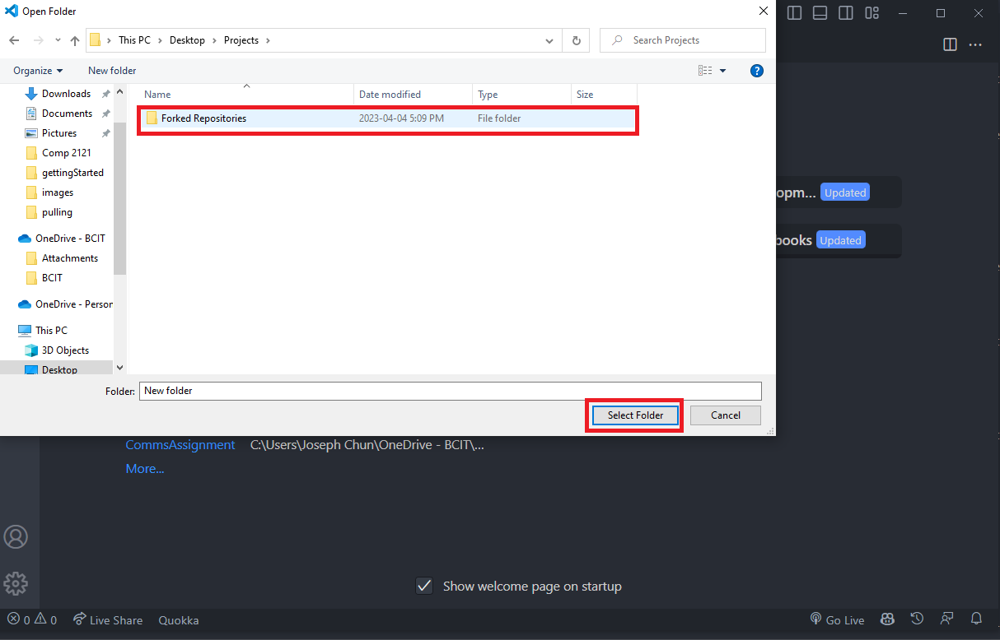
     
     

4.  Open a new terminal window in Visual Studio Code by clicking on the **“Terminal”** tab in the top menu bar and selecting **“New Terminal”**.

    The working directory should be the directory where you want to fork the repository. We will come back to this terminal window later.
     
     
    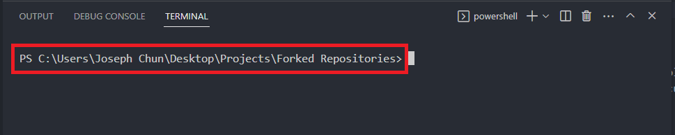
     

    !!! Tip "Tip"

          Revisit [Adding Files to Repository](../gettingStarted/#adding-files-to-the-repository) for more information on how to change your working directory.

     

5.  Go on [GitHub](https://github.com) and find a repository you want to fork.
     
     

6.  Click on the **"Fork"** button in the top right corner.

    This will create a copy of the repository in your own GitHub account.
     
     
    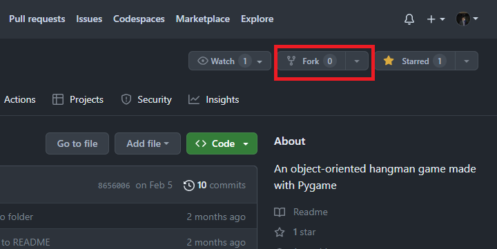
     

    !!! Info "Forked Repositories"

        Forked repositories are a copy of the original repository. They are not linked to the original repository. This means that you can make changes to the forked repository without affecting the original repository.

     

7.  Change the repository name, or description if you want to.

    This is optional, but it is a good idea to change the repository name so that you can tell it apart from the original repository.
     
     

8.  Click on the **"Create fork"** button to finish forking the repository.
     
     
    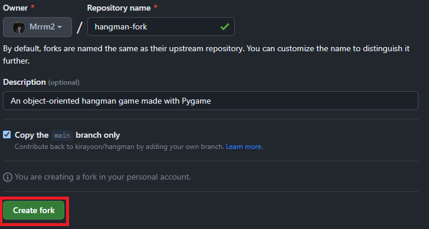
     
     

9.  **Navigate to your forked repository** on GitHub by going to your GitHub profile and clicking on the repository name.
     
     

10. **Copy the URL** from the **"Code"** dropdown button on GitHub.
     
     
    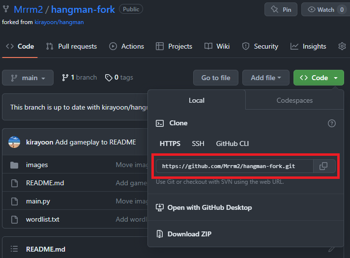
     
     

11. Go back to the terminal we set up in step 3 and run the command **`git clone [repository URL]`**.

    Replace the `[repository URL]` with the **URL you copied** in the previous step.
     
     
    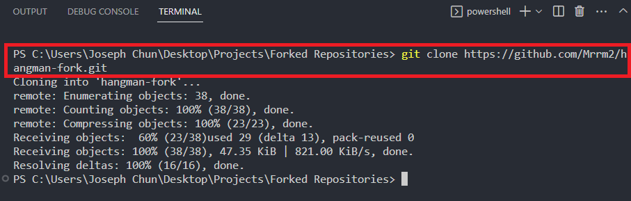
     
     

12. Change your current directory to the directory of your local repository by using the **`cd`** command.

    For a refresher, see the tip in step 4.
     
     

13. Create a **new branch** for your changes using the command **`git checkout -b [branch name]`**.

    You can name the branch whatever you want, but it is a good idea to name it something that describes the changes you are making.

    For example, if you are adding a new feature, you could name the branch "add-feature".
     
     
    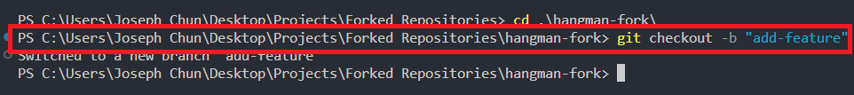
     
     

    !!! Success "Success"

            You have now successfully created a forked repository and cloned it to your local machine. You can now make changes to the repository and push them to your forked repository on GitHub. This will allow you to make changes to the repository without affecting the main branch.

## How to Submit a Pull Request

1.  Make the changes that you want to contribute to the original repository.

    Once you have made and tested your changes, stage and commit them using the **`git add`**, and **`git commit`** commands.
     
     

2.  Push your changes to your forked repository on GitHub using the command **`git push origin [branch name]`**.

    Replace the `[branch name]` with the **name of the branch that you created** in the previous section.
     
     
    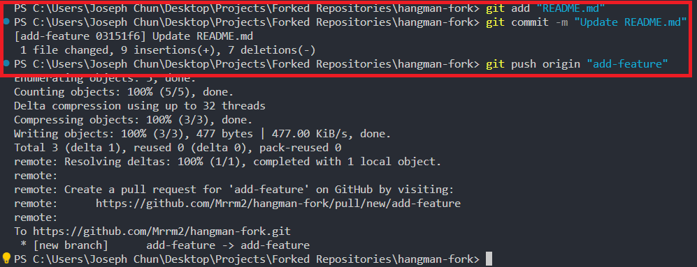
     
     

3.  Once your changes are pushed to your forked repository, go to the **original repository on GitHub** and click on the **"Compare & pull request"** button.
     
     
    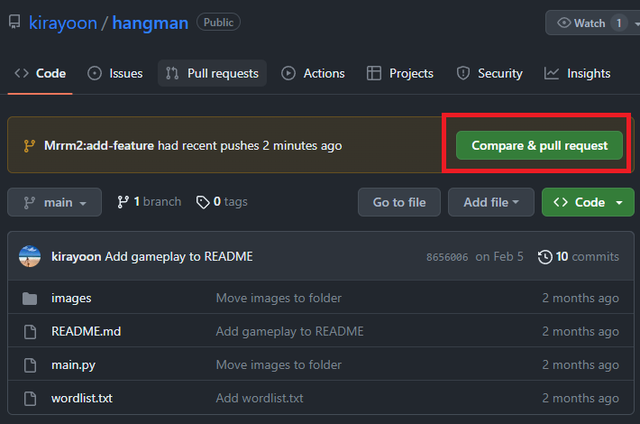
     

    !!! Tip

           Make sure you are on the GitHub page for the original repository and not your forked repository.

    !!! Tip "No Compare & Pull Request button?"

           If you do not see the "Compare & pull request" button, it means that you do not have permission to create a pull request. This is because you do not have write access to the original repository. You will need to contact the owner of the original repository and ask them to give you write access.

     

4.  **Select the branch** that you want to merge into the original repository.

    This should be the branch that you created in the previous section.
     
     
    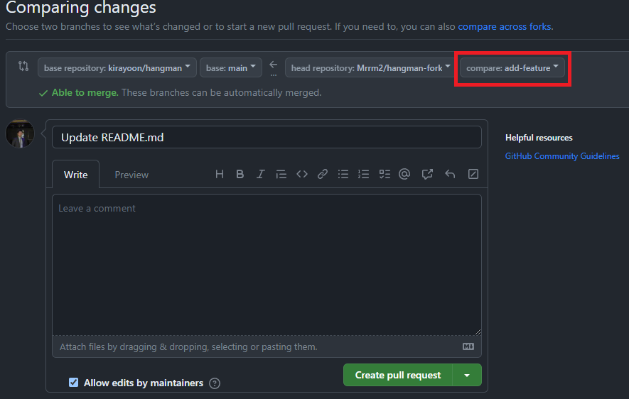
     

    !!! Info "Pull Request GUI"

           The dropdown menus on the left side of the screen allow you to select the branch of the original repository that you want to merge into. The dropdown menu on the right side of the screen allows you to select the branch that you want to merge from. This is where you select your local changes.

     

5.  Review the changes that you are proposing in the pull request and make sure that everything is correct.

    Click on the **"Create pull request"** button.
     
     
    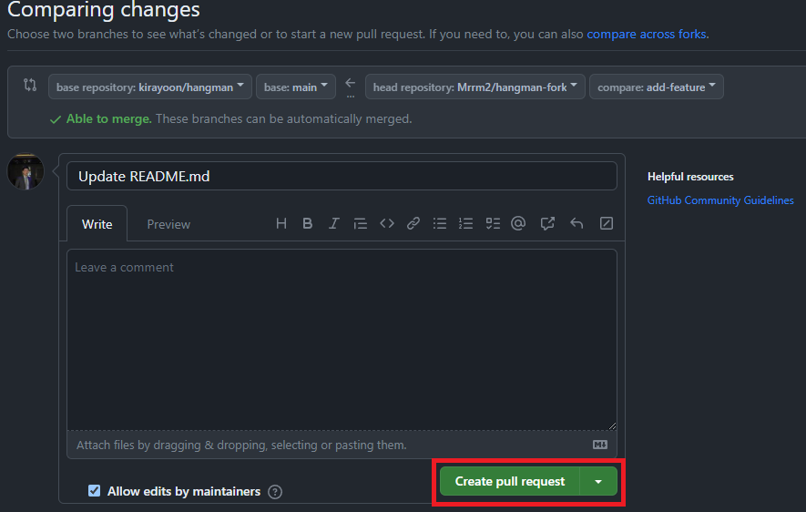
     
     

    !!! Success "Success"

            You have now successfully created a pull request. Creating a pull request will notify the owner of the original repository that you have submitted changes. The will be able to review and potentially merge your changes into their repository. This will notify the owner of the original repository that you have submitted changes and they will be able to review and potentially merge your changes into their repository.

## Conclusion

By the end of this section you will have successfully learned about and completed the following tasks:

- [x] Forked a repository on GitHub
- [x] Cloned a repository to your local machine
- [x] Created a new branch
- [x] Pushed your changes to your forked repository
- [x] Created a pull request for your changes

Congratulations! You have now completed the **Forking a Repository** section. This is the third and final section of this user guide. Hopefully, by now you have a better understanding of how to use Git and GitHub. If you encountered any issues, make sure to take a look at the **[Troubleshooting](../troubleshooting)** section.
