# Getting Started With Git and GitHub

## Overview

Git and GitHub are powerful tools used throughout the industry to manage code and collaborate with other developers. This section will cover the basics of using Git and GitHub. It will cover topics such as creating a repository, and pushing new code. By the end of this section, you should have a basic understanding of how to use Git and GitHub to collaborate with other developers.

!!! Danger "Prerequisites"

    Before continuing with the guide, make sure you have completed the following prerequisites:
    <ul>
      <li> Windows 10 installed on your computer </li>
      <li> Created a github account </li>
      <li> Installed a working version of Git </li>
      <li> Installed Visual Studio Code </li>
    </ul>

## Creating a Remote Repository

1.  First, navigate to <https://github.com> and **log into your GitHub** account.

    If you do not have an account, create a GitHub account by going to <https://github.com/join>.
     
     

2.  After logging in, click on the **“+”** sign in the top right corner of the page.
     
     

3.  Select **“New repository”** from the dropdown menu.
     
     
    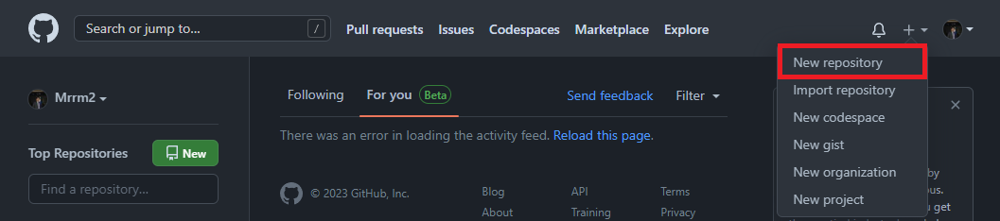
     
     

4.  On the “Create a new repository” page, enter a **name for your repository** in the **“Repository name”** field.

    Make sure to choose a name that describes what your code does. You can also add a description if you like.
     
     
    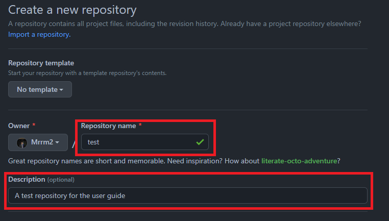
     
     

5.  Select the **repository’s visibility**.

    If you want your code to be public, leave the repository as public. If you want it to be private, select “Private”.
     
     
    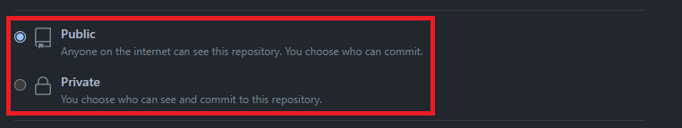
     

    !!! Info

            Public repositories are visible to anyone on the internet. Private repositories are only visible to the owner and collaborators. If you are unsure which option to choose, select private. The visibility of your repository can be changed at any time.

     

6.  Check the box that says “Initialize this repository with a README” to create a README file in your repository that you can edit later.
     
     
    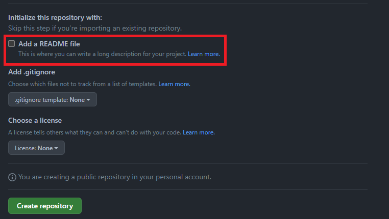
     

    !!! Info

            A README file is a text file that contains information about your project. _It is always best practice to include a README file in your repository_ because it will help other people understand what your project is about.
            For more information about README files, see <https://docs.github.com/en/github/creating-cloning-and-archiving-repositories/about-readmes>.

     

7.  Click the **“Create repository”** button at the bottom of the page when you are ready to finalize the changes and create your repository.
     
     
    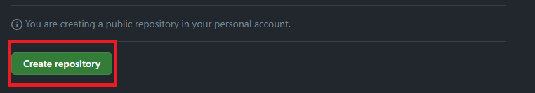
     
     

    !!! Success

            At this point, you have successfully created a new repository on GitHub. You can now continue with the guide to learn how you can create a local copy of your repository on your computer.

     

## Creating a Local Copy of the Repository

1.  Use file explorer to **create a folder** on your computer where you want to store your repository.

    !!! Tip

            It is always best practice to create a new folder for each project you work on. This will keep your projects organized and make it easier to find them later.

     

2.  Open **Visual Studio Code**.
     
     

3.  Click on the **“File”** tab in the top left corner of the screen and select **“Open Folder”**.
     
     
    
     
     

4.  Navigate to the directory you just created, select it and click the **“Select Folder”** button.
     
     
    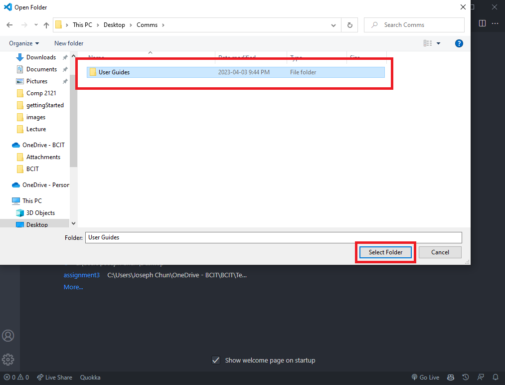
     
     

5.  Open a terminal in your Visual Studio Code by clicking on the **“Terminal”** tab in the top left of the screen and select **“New Terminal”**.

    This will create a new terminal instance in the directory you are currently in.
     
     
    
     
     

6.  Navigate to the GitHub repository you created in steps 2 to 6 of the previous section.
     
     
7.  Click on the **“Code”** button and **copy the URL** of the repository.
     
     
    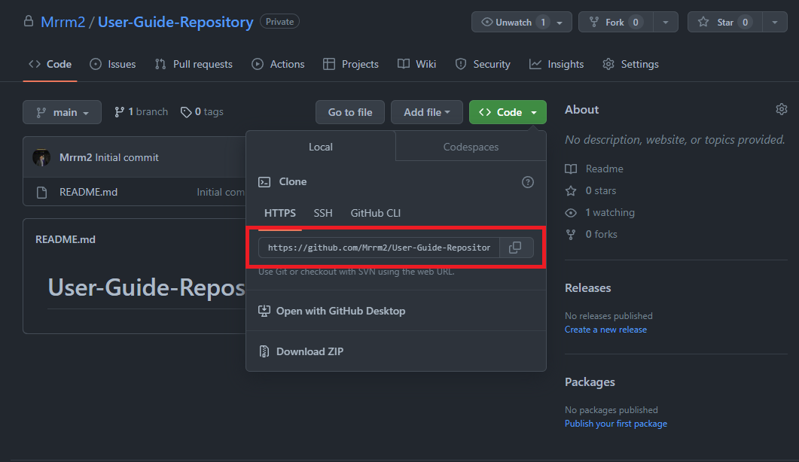
     
     

8.  Return to the Visual Studio Code terminal, and use the **`git clone [repository URL]`** command to link the remote repository to your local repository.

    Replace the `[repository URL]` with the **URL you copied** in the previous step.
     
     
    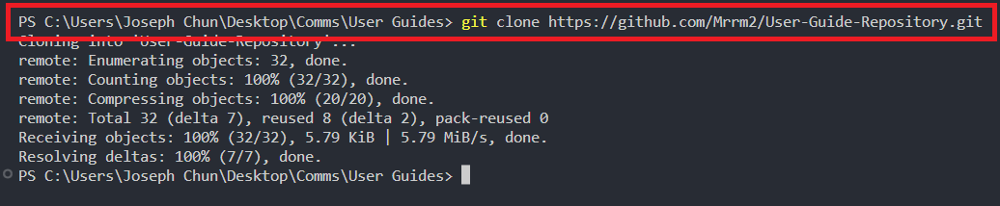
     

    !!! Danger "git clone: command not found"

         If you get the error `git clone: command not found`, it means you may have not installed Git correctly. To fix this, go back to the introduction page and try installing Git again.

     

    !!! Success

         You have successfully created a local copy of the repository in your computer. After you have added a few files to your local repository, continue with the guide to learn how you can push them to a remote repository on GitHub!

     

## Adding Files to the Repository

After making some changes in your local repository, you can add them to the remote repository on GitHub. To do this, you will need to follow the Git workflow. If you need a refresher on the Git workflow, you can review the Git workflow section in the introduction page. To add files to the repository, follow the steps below:

!!! Danger "Double Check"

    Make sure that the directory displayed in the terminal is the directory of your local repository before continuing.
        <ul>
            <li>Use the `pwd` command to see your working directory</li>
            <li>Navigate to the correct by using the `cd` command if the working directory is not the directory of your local repository</li>
            <li>Use the `cd ..` command to navigate to the parent directory of the current directory</li>
        </ul>

    For more information on Windows command line commands, see <https://www.freecodecamp.org/news/command-line-commands-cli-tutorial/>.

1.  Change your working directory to the directory of your local repository by typing **`cd [directory name]`** into the terminal.

    Replace the `[directory name]` with the **name of the directory** you created in the previous section.
     
     
    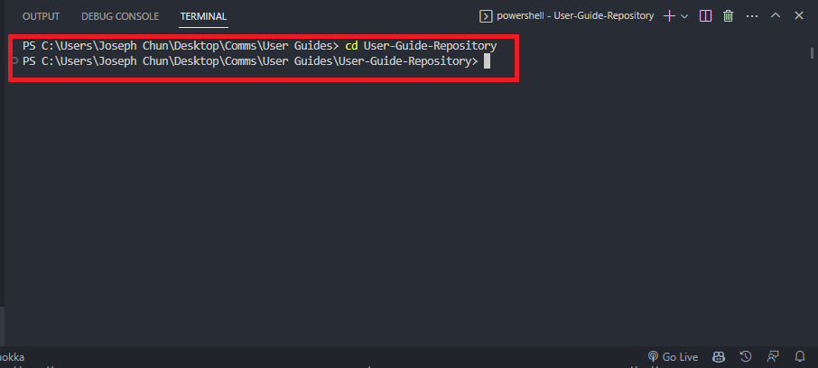
     
     

2.  Use the **`git add`** command to add the files to the staging area.

    If you want to add a file called `index.html`, type **`git add index.html`** into the terminal.

    Alternatively, you can **add all the files** in the directory by typing **`git add .`** into the terminal.
     
     
    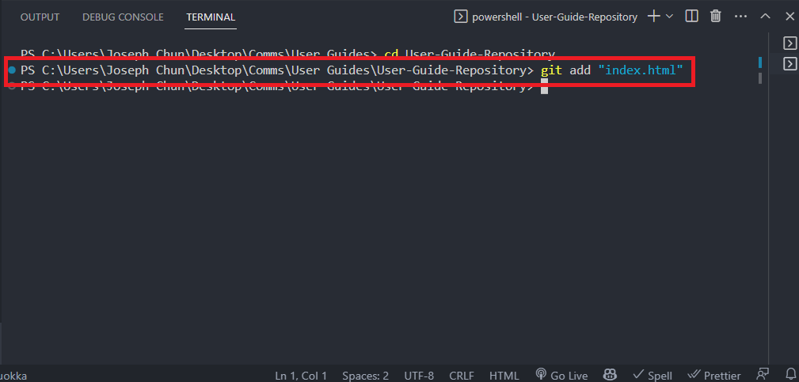
     

    !!! Info "`git add`"

               This is the first step of the Git workflow. The staging area is a temporary area where you can add files before committing them to the repository. You can add as many files as you want to the staging area before committing them to the repository. For more information about the Git workflow, you can review the Git workflow section in the [What is Git](../#what-is-git) section.

    !!! Tip

               If at anytime you are unsure about what files are in the staging area, you can type `git status` into the terminal. This will show you a list of all the files in the staging area.

     

3.  Commit the changes using the **`git commit -m "[Your commit message]"`** command. Replace the `[Your commit message]` with a message that describes the changes you made.

    For example, if you added a new file called `index.html`, you can write a commit message like “Add index.html file”.
     
     
    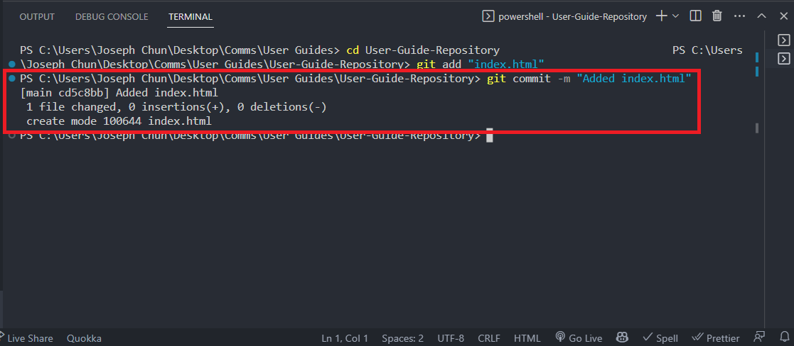
     

    !!! Info "`git commit`"

            This is the second step of the Git workflow. After adding the files to the staging area, you can commit them to the repository. For more information about the Git workflow, you can review the Git workflow section in the [What is Git](../#what-is-git) section.

    !!! Info "Best Practices"

            It is always best practice to add a message when committing your changes. This will help you and others understand what changes you made. It is also best to write a commit message starting with a verb in the present tense. For example, if you fixed a bug in the code, you can write a commit message like “Fix bug in code”.

     

4.  Use the **`git push`** command in the terminal.

    This will push the changes to the remote repository on GitHub. You should see a similar output message in the terminal.
     
     
    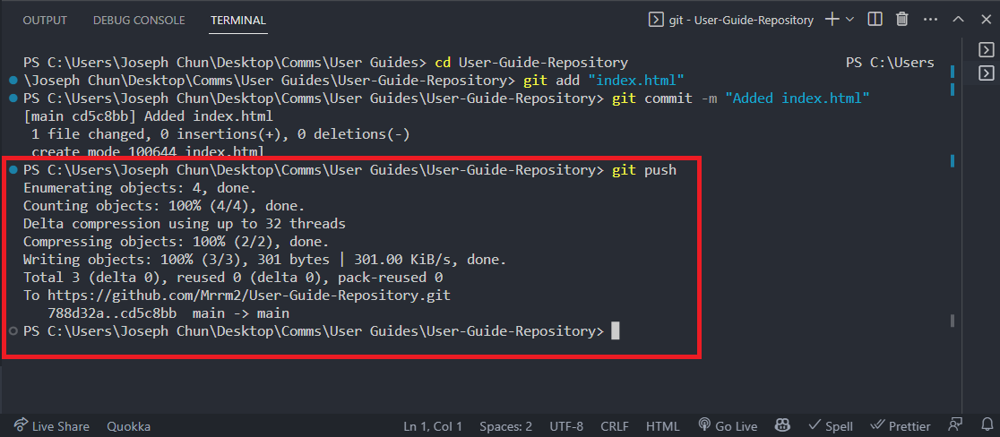
     

    !!! Info "`git push`"

            This is the third step of the Git workflow. After committing the changes, you can push them to the remote repository on GitHub. For more information about the Git workflow, you can review the Git workflow section in the [What is Git](../#what-is-git) section.

     

    !!! Success "Congratulations!"

            You have successfully pushed your code to GitHub. You should now be able to see your code on GitHub. When you make more changes in the future, you can follow the same steps to push your code to GitHub.

## Conclusion

By the end of this section you will have successfully learned about and completed the following tasks:

- [x] Create a remote repository on GitHub
- [x] Create a local copy of a repository on your computer
- [x] Add files to the repository

Congratulations! You have successfully completed the **Getting Started** section. Use the following link to move onto the **[Pulling and Merge Conflicts](../pullingAndMerge/)** section.
