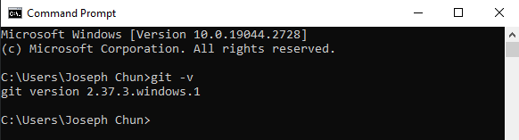
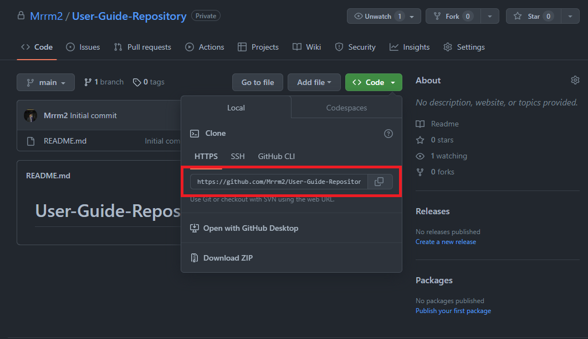

# Introduction

This document is a guide to using [Git](https://git-scm.com/) and [GitHub](https://github.com/). The aim of this guide is to provide a comprehensive introduction to basic Git and GitHub concepts and workflows. We will cover topics such as: creating a repository, pushing and pulling changes, branching, merging, and resolving merge conflicts. By the end of this guide, you should have a basic understanding of how to use Git and GitHub to collaborate with other developers.

## Intended Audience

This documentation is intended for the following users:

- Beginner developers who are new to using Git and GitHub
- Developers who would like to learn more advance techniques such as forking, and creating pull requests

## What is Git?

Git is a powerful tool used heavily throughout the software development industry. It is used to track changes in code, collaborate with other developers, and manage projects. In this guide, we will be learning how to use Git to manage our code and the basic Git workflow.
<br />

<figure>

<figcaption>Basic Git workflow</figcaption>
</figure>
<br />

In Git, a common workflow involves making changes to your code, staging those changes, committing them, and then pushing those commits to a remote repository (such as GitHub). This is similar to the process of editing, saving and printing out a Word document:

1. Editing the document: Just like how you might edit a Word document to make changes, you can make changes to your code in a local Git repository.

2. Saving the document: Once you're done editing, you'll want to save your Word document to ensure that your changes are stored. Similarly, in Git, you'll want to “stage” your changes. This corresponds with the `git add` step in the workflow.

3. Exporting as a PDF: To ensure that your document looks the way you want it to when you print it out, you can export it as a PDF file. In Git, committing your changes is like "exporting" them to a permanent state in your local repository.

4. Printing the document: Finally, to show off your work, you might choose to print out your document. In Git, “pushing” your committed changes to a remote repository is like "printing out" your code changes so that others can see and use them.

So to sum it up, just like how you would edit, save, export, and print a Word document to make changes visible, in Git, you would make changes to your code, stage them, commit them, and push them to a remote repository to make your code changes visible to others.

## What is GitHub?

GitHub is a website that allows developers to store their code in a remote repository. It is a popular platform for developers to collaborate on projects and share their code with others. GitHub is a great tool for developers to use to manage their code and collaborate with others. In this guide, we will be learning how to use GitHub to manage our code and collaborate with others.

## Software and Prerequisites

This guide was written for the Windows 10 operating system. In the specific guide, we will be using Git version 2.37.3 for Windows, and Visual Studio Code version 1.76.2. If you are using a different operating system, such as MacOS or Linus, some steps and commands in this guide may not be suitable. Specific guides for other operating systems are available online.

Before continuing, ensure that you have the following:

- Windows 10 installed on your computer
- A [GitHub](https://github.com) account
- [Git](https://git-scm.com/) version 2.37.3
- [Visual Studio Code](https://code.visualstudio.com/) version 1.76.2 or higher

#### Registering for Github

You can register for a github account at <https://github.com/join>.

#### Installing git

1. Install Git by following the specific instructions for your operating system at <https://git-scm.com/book/en/v2/Getting-Started-Installing-Git>.
2. Navigate to the bottom left of the screen and click the search bar.
3. Type cmd and press enter to open a command prompt window.
   <br />
   
   <br />
   <br />
4. Verify you have Git installed by running the following command `git -v`.
   <br />
   
   <br />
   <br />

5. Your command prompt should display your current Git version if you have successfully installed git.

!!! Tip

     If you are unsure what a command does, you can type `git help <command>` into the terminal to get more information about the command. For example, if you want to know what the `git -v` command does, type `git help -v` into the terminal.

#### Installing Visual Studio Code

Visual Studio Code is a free, open-source code editor that is available for Windows, MacOS, and Linux. You can download Visual Studio Code at <https://code.visualstudio.com/download>. Ensure that you download the correct installer for your operating system.

## Typographic Conventions

Throughout the document we will use several different typographic conventions to highlight important information. The following are examples of various typographic conventions used in this document.

1.  Code blocks and inline code
    Code blocks and inline code blocks are used to identify commands that should be run in the terminal. `git -v` is an example of an inline code block, while the following is an example of a code block:

    ```bash
    git add .
    git commit -m "Initial commit"
    git push
    ```

2.  Bold text
    Bold text is used to highlight important information such as file names, and crucial steps.
3.  Quotation marks
    Quotation marks are used to signify UI elements such as titles, and buttons. For example: "Open File"

4.  Image annotations
    Aspects of each image related to the instruction will be enclosed in a red box. See the following for an example of an image for the step "Copy the URL of the remote repository":
    <br />
    <br />
    
    <br />
    <br />

## Notes and Warning Convention

Throughout the document we will use several different conventions to highlight important information. The following conventions are ordered from most to least important.

!!! Danger

      This is a danger message. It is used to highlight information that is critical to the guide.

!!! Warning

      This is a warning message. It is used to highlight information that is important to the guide, or things for the user to look out for.

!!! Tip

      This is a tip message. It is used to highlight information that may help the user to complete a task.

!!! Info

      This is an info message. It is used to provide extra information to broaden the user's understanding.

!!! Success

      This is a success message. It is used to highlight that the user has successfully completed a task.
