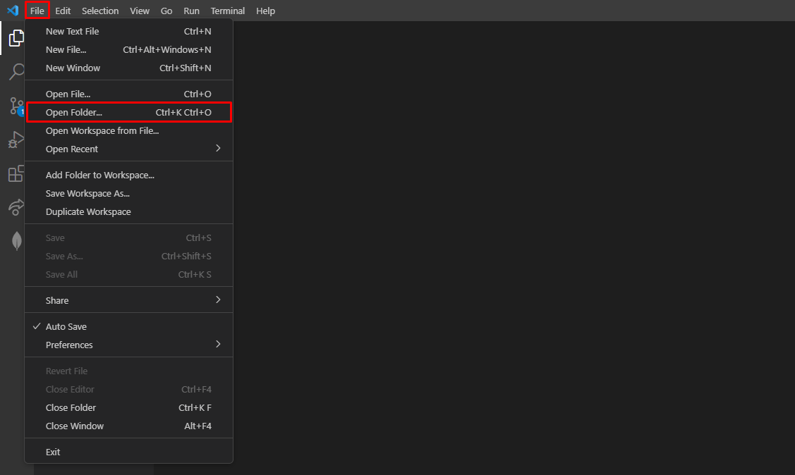
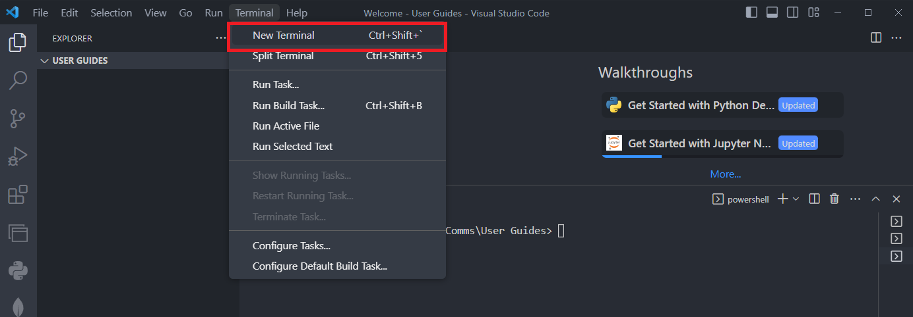
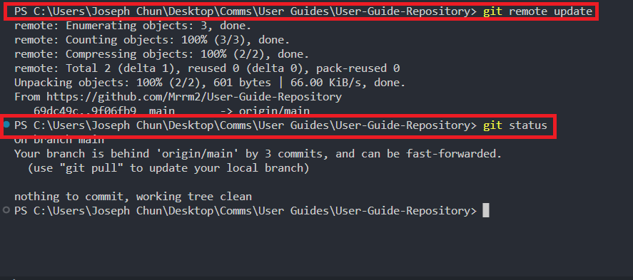
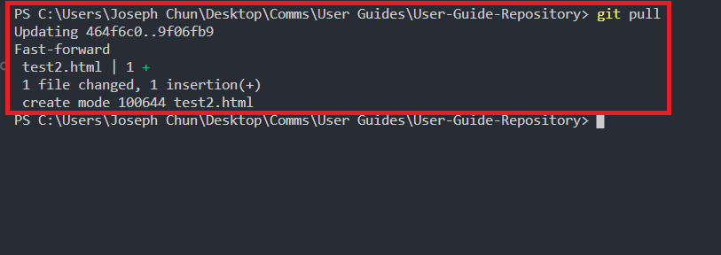
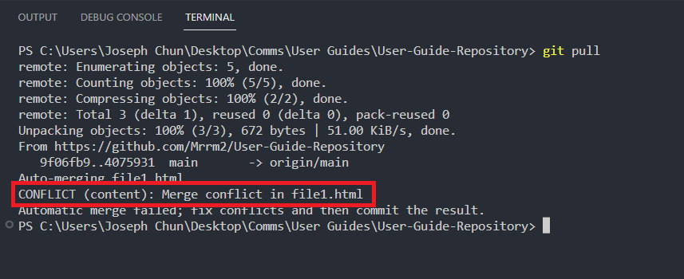
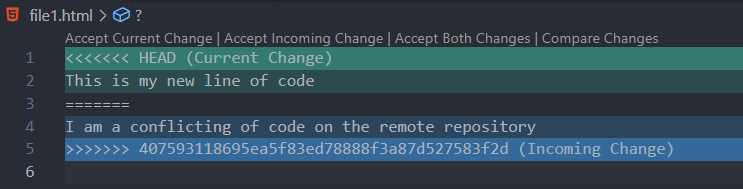
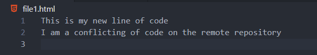
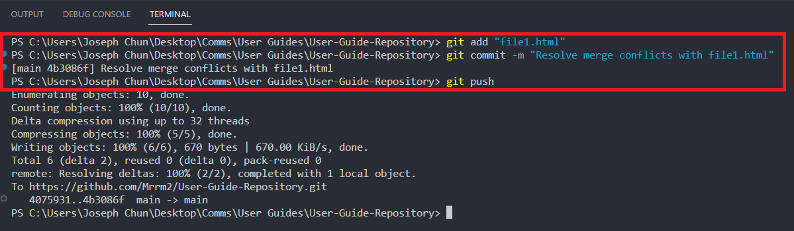

# Pulling and Resolving Merge Conflicts

## Overview

This guide will walk you through the process of creating a repository on GitHub and cloning it to your local machine. You will also learn how to add files to the repository you created and push them to GitHub.
Since GitHub is a collaborative platform, others can contribute to a repository as well. You may find that the copy of the repository on your computer is different from what is on GitHub. Therefore, it is important to know how to pull changes from a remote repository and resolve merge conflicts. This guide will walk you through the process of pulling changes from a remote repository and resolving merge conflicts.

## Pulling from a remote repository

1.  Open **Visual Studio Code** and open the directory of your local repository.

    You can do this by clicking on the **“File”** menu in the top left and selecting **“Open Folder”**.
    <br />
    <br />
    
    <br />
    <br />

2.  Open a terminal instance by clicking on the **“Terminal”** tab in the top left and selecting **“New Terminal”**.

    Ensure that the working directory is the directory of your local repository.
    <br />
    <br />
    
    <br />
    !!! Tip "Tip"

          Revisit [Adding Files to Repository](../gettingStarted/#adding-files-to-the-repository) for more information on how to change your working directory.

    <br />

3.  Input the following commands into the terminal to check the status of your local repository:

    ```bash
    git remote update
    git status
    ```

    If you do have uncommitted changes, you will need to **commit them before you can pull** any changes from GitHub. Please refer to the [Getting Started](../gettingStarted/#adding-files-to-the-repository) page for instructions on committing changes. If you do not have any uncommitted changes or have committed your changes, you can proceed to the next step.
    <br />
    <br />
    
    <br />

    !!! Info "`git remote update` and `git status`"

        The `git remote update` command will update the local repository with the latest changes from GitHub. The `git status` command will check the status of your local repository. This will show you if you have any uncommitted changes.

    <br />

4.  Use the **`git pull`** command to pull any changes made to the repository.
    <br />
    <br />
    
    <br />

    This will update your local repository with the latest changes from GitHub. You should see a description of the changes that were pulled from GitHub.

    !!! Warning "Merge conflicts"

            If you receive a message that says `Automatic merge failed; fix conflicts and then commit the result`, this means that there are merge conflicts in your local repository. You will need to resolve the merge conflicts before you can push your changes to GitHub. Please refer to the [Resolving merge conflicts](#resolving-merge-conflicts) section for instructions on resolving merge conflicts.

    <br />

5.  If you receive additional error messages, please refer to the [Troubleshooting](../troubleshooting) page for help.
    <br />
    <br />

    !!! Success

          You have successfully pulled changes from a remote repository! You can now see your changes on your local repository.

    <br />

## Resolving merge conflicts

When working as a team, it is possible that you and your team members will make changes to the same file. When this happens, Git will not be able to automatically merge the changes. Instead, Git will mark the file as having a merge conflict. You will need to resolve the merge conflict before you can push your changes to GitHub. Merge conflicts might seem daunting the first time you encounter them, but this guide will walk you through the process of resolving merge conflicts using Visual Studio Code.

1.  Identify the file(s) with conflicts by looking at the **output of the `git pull`** command. The file(s) with conflicts will be listed in the output.

    For example, the image below shows that the file `file1.html` has conflicts.
    <br />
    <br />
    
    <br />
    <br />

2.  Open the file(s) with conflicts in Visual Studio Code and look for the conflict markers which look like `<<<<<<<`, `=======`, and `>>>>>>>`.

    Below is an example of what you might see in a file with conflicts.
    <br />
    <br />
    
    <br />

    These markers indicate where the changes from both sides of the conflict begin and end.

    - The `<<<<<<<` marker indicates the **beginning of your changes**.

    - The `=======` marker indicates the **end** of the changes from **your local repository** and mark the **start** of the changes from the **remote repository**.

    - The `>>>>>>>` marker indicates the **end** of the changes from the **remote repository**.
      <br />
      <br />

3.  Edit the file to resolve the conflict.

    You can choose to keep the changes from your local repository, the changes from the remote repository, or a combination of both. Once you have resolved the conflict, remove the conflict markers and save the file

    Below is an example of what the file might look like after resolving the conflict.
    <br />
    <br />
    
    <br />
    <br />

4.  After resolving all conflicts, add the changes to the staging area using the **`git add`** command.

    For example, using the command `git add file1.html` will add a file called `file.html` to the staging area.
    <br />
    <br />

5.  Use the **`git commit`** command to commit the changes with a message describing the conflict resolution.

    For example, type `git commit -m "Resolve merge conflicts with file1.html"`.
    <br />
    <br />

6.  Finally, use the **`git push`** command to push your changes back to GitHub.
    <br />
    <br />
    
    <br />
    <br />

    !!! Success "Congratulations!"

          You have successfully solved your first merge conflict! You can now see your changes on GitHub.

## Conclusion

By the end of this section you will have successfully learned about and completed the following tasks:

- [x] pull changes from a remote repository on GitHub
- [x] resolve merge conflicts

Congratulations! You have successfully completed the **Pulling and Resolving Merge Conflicts** section of this user guide! Use the following link to move onto the **[Forking a Repository](../forksAndPR)** section.
